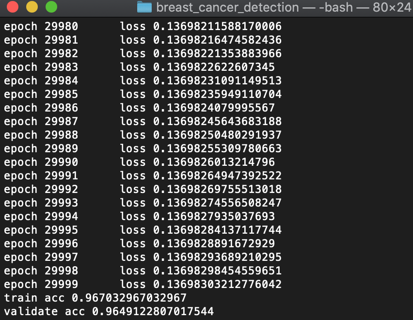
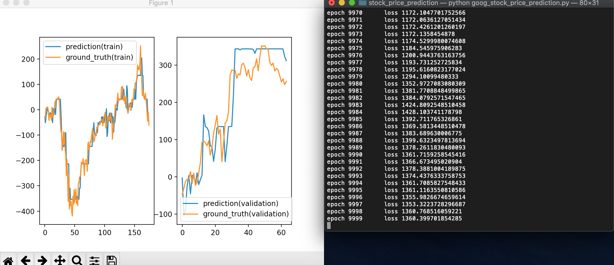

# DeepFrame
## This is a deep learning framework library built from scratch (only based on Numpy). 

This framework works in a similar way as pytorch does where a tensor is the basic operation unit. An automatic differentiation is automatically done for each tensor operation (similar to pytorch.autograd). In this case, this framework is not only limited to the deep learning but also scientific projects where numerical differentiation of tensor operations is needed.

Current version has:

1. a built-in ADAM and a SGD optimizer (**[DeepFrame.optimizers](DeepFrame/optimizers.py)**)
2. some activation functions, i.e., sigmoid, softmax, tanh, ReLU, dropout (**[DeepFrame.functions](DeepFrame/functions.py)**)
3. a high-level Dense layer and an unidirectional RNN layer object (**[DeepFrame.layers](DeepFrame/layers.py)**)
4. some loss functions, i.e., MSE, MAE, Cross_entropy, focal_loss (**[DeepFrame.losses](DeepFrame/losses.py)**)
5. model/parameters save/load functions (**[DeepFrame.module](DeepFrame/module.py)**)

To download this framework:
```
git clone https://github.com/dingzhiyue/DeepFrame
```


## Examples using DeepFrame 
### Example 1. Build a simple neural network to do a 'breast cancer classification' task.
The data comes from kaggle **[Breast Cancer Wisconsin data set](https://www.kaggle.com/uciml/breast-cancer-wisconsin-data)**. 
This task is to classify Benign and Maligant breast cancer based on clinic data.

Import DeepFrame framework
```
from DeepFrame.tensor import Tensor
from DeepFrame.module import Module, save_model, load_model
from DeepFrame.optimizers import Adam
from DeepFrame.losses import binary_CE_loss
from DeepFrame.metrics import accuracy
from DeepFrame.layers import Dense
```
Create model class (subclass of DeepFrame.Module) by initializing the layers and define a forward function. These define the structure of the neural network.
```
class breast_cancer_model(Module):
    def __init__(self, input_shape):
        self.layer1 = Dense(input_shape, 10, 'sigmoid', 'layer1')
        self.layer2 = Dense(10, 1, 'sigmoid', 'layer2')
    def forward(self, train_x:'tensor')->'tensor':
        y1 = self.layer1.forward(train_x)
        y2 = self.layer2.forward(y1)
        return y2
```
Define a fit function to train the model where the input are training data as DeepFrame.tensor objects.
```
    def fit(self, train_x:'tensor', train_y:'tensor'):
        epochs = 30000
        lr = 0.001
        optimizer = Adam(lr, self)
        for epoch in range(epochs):
            self.zero_grad()
            y_pred = self.forward(train_x)  #forward propagation
            loss = binary_CE_loss(y_pred, train_y)  #get loss function
            loss.backward()  #backward propagation
            optimizer.update(self)  #update weights
            print('epoch', epoch, '     loss', loss.data)
```
Define a validation function.
```
    def validate(self, validate_x:'tensor', validate_y:'tensor'):
        y_pred = self.forward(validate_x)
        acc = accuracy(y_pred, validate_y)
        print('validate acc', acc)
```
Start the training. (Data preparation details can be found in **[breast_cancer_detection.py](Projects_using_DeepFrame/breast_cancer_detection/breast_cancer_detection.py)**)
```
if __name__=='__main__':
    train_x, train_y, validate_x, validate_y = load_data()
    train_x, train_y, validate_x, validate_y = data_prepare(train_x, train_y, validate_x, validate_y)
    model = breast_cancer_model(train_x.data.shape[1])
    model.fit(train_x, train_y)
    model.validate(validate_x, validate_y)
    save_model(model,'bc_model')
```

#### We can very easily get a 96% accuracy on both training and validating set by implementing a very simple neural network!


### Example 2. Build a simple unidirectional RNN to predict Google stock price.

Import DeepFrame framework
```
from DeepFrame.tensor import Tensor
from DeepFrame.module import Module, Parameter, save_model, load_model
from DeepFrame.optimizers import Adam
from DeepFrame.losses import MSE_loss, MAE_loss
from DeepFrame.layers import RNN
```

Create model class (subclass of DeepFrame.Module) by initializing a single RNN layer and define a forward function.
```
class stock_price_model(Module):
    def __init__(self, input_size):
        self.layer1 = RNN(input_size, hidden_size=20, num_layers=1, activation='linear', bias=True)
    def forward(self, input_data:'tensor')->'tensor':
        return self.layer1.forward(input_data)
```

Define a fit function to train the model.
```
    def fit(self, train_x:'tensor', train_y:'tensor'):
        epochs = 10000
        lr = 0.01
        optimizer = Adam(lr, self)
        for epoch in range(epochs):
            self.zero_grad()
            y_pred, _ = self.forward(train_x)
            loss = MSE_loss(y_pred, train_y)
            loss.backward()
            optimizer.update(self)
            print('epoch', epoch, '     loss', loss.data)
```

Define a validation function to plot predictions on both training and validating data set. Figure plots requires an additional depedency on matplotlib.
```
    def validate(self, train_x:'tensor', train_y:'tensor',validate_x:'tensor', validate_y:'tensor'):
        y_pred_train, _ = self.forward(train_x)
        y_pred_validate, _ = self.forward(validate_x)
        plt.figure()
        plt.subplot(1,2,1)
        plt.plot([i for i in range(train_x.data.shape[0])], y_pred_train.data)
        plt.plot([i for i in range(train_x.data.shape[0])], train_y.data)
        plt.legend(['prediction(train)', 'ground_truth(train)'])
        plt.subplot(1,2,2)
        plt.plot([i for i in range(validate_x.data.shape[0])], y_pred_validate.data)
        plt.plot([i for i in range(validate_x.data.shape[0])], validate_y.data)
        plt.legend(['prediction(validation)', 'ground_truth(validation)'])
        plt.show()
```

Start the training (data preparation can be found in **[goog_stock_price_prediction.py](Projects_using_DeepFrame/stock_price_prediction/goog_stock_price_prediction.py)**)
```
if __name__=='__main__':
    train_x, train_y, validate_x, validate_y = load_data()
    model = stock_price_model(input_size=1)
    model.fit(train_x, train_y)
    model.validate(train_x, train_y, validate_x, validate_y)
    save_model(model, 'goog_price_prediction_model')
```

#### A very simple RNN model can do the prediction quite well!

